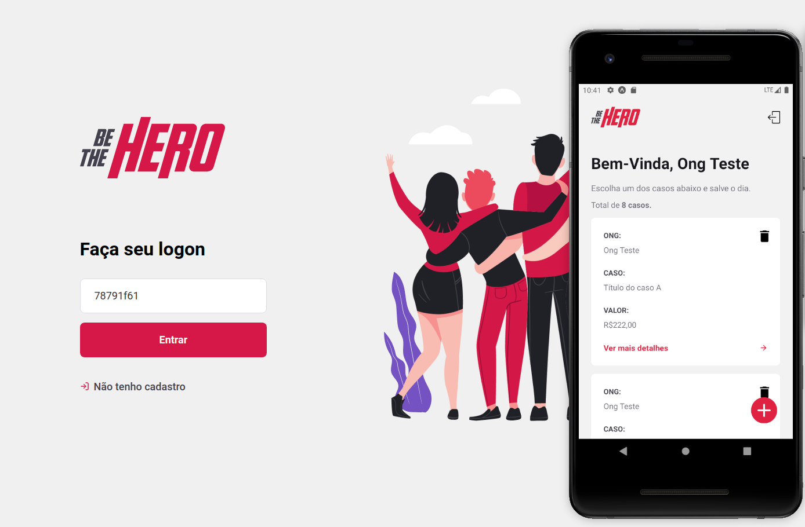

# Be The Hero

Aplicação web e mobile desenvolvida na semana OmniStack 11 da RocketSeat.

A Be The Hero tem como objetivo auxiliar na doação de casos de animais de ruas registrados pelas ONG's cadastradas no sistema. Com isso, os usuários poderão ajudar doendo valores para os casos entrando em contato com a ONG via whatsapp ou e-mail.

Para a aplicação mobile, desenvolvi além do que foi proposto na semana, permitindo que todo o fluxo de cadastro e ajuda/doação seja realizado.

## Construído com

* Node.js
* ReactJS
* React Native
* Expo
* Axios

## Principais componentes utilizados no mobile (com excessão aos triviais)

* AsyncStorage
* FlatList
* KeyboardAvoidingView
* TouchableOpacity
* TouchableWithoutFeedback
* ScrollView

## Autor

Rafael Rodrigues
