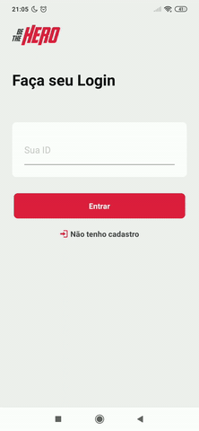

# Be The Hero

Aplicação *web* e *mobile* desenvolvida na semana OmniStack 11 da [RocketSeat](https://rocketseat.com.br/).

A Be The Hero tem como objetivo auxiliar no registro e doação para casos de animais de ruas de ONG's de uma cidade. Os casos são registrados e mantidos pelas ONG's. Os usuários do aplicativo poderão doar valores para os casos entrando em contato com a ONG via whatsapp ou e-mail.

Demonstração da app mobile.

## Construído com

* Node.js
* ReactJS
* React Native
* Expo
* Axios

## Principais componentes utilizados no mobile (com excessão aos triviais)

* AsyncStorage
* FlatList
* KeyboardAvoidingView
* TouchableOpacity
* TouchableWithoutFeedback
* ScrollView

## Autor

Rafael Rodrigues
